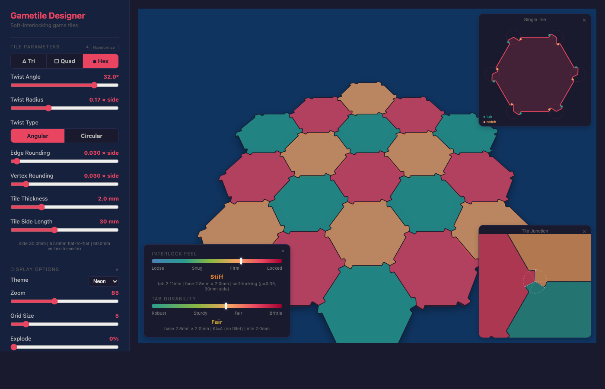

# Hextile Designer

Interactive design tool for laser-cut hexagonal board game tiles that interlock via a twist mechanism at 3-tile vertex junctions.

**[Try it live](https://heathdutton.github.io/hextile-designer/)**

## Features

- Adjustable twist angle, radius, and corner rounding
- Angular or arc-based joint geometry
- Physics-based interlock feel and tab durability gauges
- 6 color schemes (Synthwave default)
- SVG export (single tile and full grid)
- Tile side length presets for common board game sizes (10–60mm)
- URL state sharing
